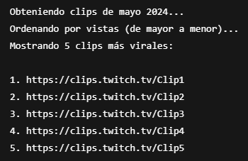

# TwitchRecap 🎥📊

Este proyecto permite recopilar clips virales de Twitch de manera automatizada utilizando la API de Twitch. Fue diseñado como un proyecto personal para practicar Python, OAuth y manejo de datos.


## 🚀 Funcionalidades
- Autenticación vía OAuth con Twitch.
- Recolección automática de los clips más populares.
- Almacenamiento local en base de datos SQLite.
- Interfaz o flujo principal para manejar los datos.



## 🧠 Tecnologías Usadas
- Python 3
- SQLite
- Twitch API
- OAuth2

## 🔒 Importante
Este repositorio no incluye datos sensibles como tokens ni bases de datos locales. Se recomienda usar un archivo `.env` o `TOKEN.txt` fuera del control de versiones para proteger información confidencial.
Este repositorio esta inconlcuso, se planea mejorar.

## 📂 Estructura del proyecto

```
TwitchRecap/
├── app.py
├── main.py
├── oauth.py
├── README.md
└── .gitignore
```

## 📄 Licencia
Proyecto personal sin fines de lucro.
